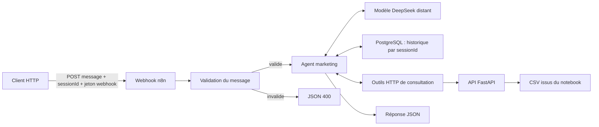

# Assistant marketing RFM avec n8n

Ce guide permet de lancer l’API et n8n en local, d’importer le workflow,
de configurer DeepSeek et PostgreSQL et de poser des questions sur les résultats du notebook.
Il s’adresse aussi aux personnes qui découvrent le dépôt.

Le fichier [taiss-tp-final.json](taiss-tp-final.json) est un modèle public :
il est **inactif**, sans clé API, sans credential lié à un compte et sans
résultats d’exécution épinglés. Chaque personne doit créer ses propres identifiants.
Son identifiant `rfmMarketingTemplate` est un identifiant technique de modèle,
sans lien avec une instance personnelle.

## Parcours depuis un clone

Suivre les étapes 2 à 11 dans l'ordre. Aucun entraînement préalable ni serveur
PostgreSQL installé sur la machine n'est nécessaire avec le Compose fourni.

| Élément | Ce que Docker prépare | Action à effectuer dans n8n |
| --- | --- | --- |
| API FastAPI | Construction de l'image et chargement des CSV fournis dans `api/data/` | Garder `http://segmentation-api:8000` dans **Configuration** ; vérifier les routes à l'étape 9 |
| PostgreSQL | Création de la base et du rôle `rfm_memory` au premier démarrage du volume | Créer le credential **Postgres**, hôte `postgres`, utilisateur et base `rfm_memory`, mot de passe choisi dans `.env` |
| Historique | Conservation dans le volume `postgres_data` ; table créée au premier usage du nœud mémoire | Relier le credential à **Memoire session** et envoyer le même `sessionId` pour continuer une discussion |
| DeepSeek | Le nœud est fourni, sans accès personnel | Créer et sélectionner un credential **OpenAI** configuré pour DeepSeek |
| Webhook | Validation de `message` et `sessionId`, authentification obligatoire | Créer le credential **Header Auth** avec `X-RFM-Token` et un jeton personnel distinct |

Il faut donc **trois credentials sélectionnés dans trois nœuds** avant le premier
message. Le mot de passe du compte administrateur n8n, celui de PostgreSQL,
la clé DeepSeek et le jeton webhook ont chacun un rôle différent.

## 1. Comprendre ce qui sera installé



- Le notebook dans `ml/` prépare les données, entraîne K-means et exporte les tables.
- L’API dans `api/` lit les CSV ; elle ne réentraîne pas les modèles.
- n8n orchestre les appels d’outils et le modèle ; DeepSeek formule la réponse.
- Les outils du chatbot consultent uniquement les **tables agrégées**. La route
  des clients individuels reste disponible dans l’API, mais n’est pas connectée à l’agent.
- La question et les résultats des outils utilisés sont transmis au fournisseur
  du modèle. Ne saisir aucune information personnelle inutile dans le message.
- Les messages portant le même `sessionId` partagent un historique stocké dans
  PostgreSQL, dont les dix dernières interactions alimentent le contexte ;
  chaque nouvel identifiant ouvre une conversation distincte.
- Il s’agit d’un assistant avec outils structurés, **sans base vectorielle**.
  Il ne réalise donc pas à lui seul tout le bonus vectoriel décrit dans le TP.

Le parcours principal utilise le [Docker Compose fourni](docker-compose.yml),
qui démarre le frontend, n8n, l’API et PostgreSQL dans une installation locale distincte de toute installation n8n existante.
Les ports sont liés à `127.0.0.1`. Cette configuration HTTP est destinée à une
machine locale ; le déploiement public est abordé à la fin du guide.

## 2. Préparer les logiciels

Installer **Git**, **Docker** et le plugin **Docker Compose**.
Aucune installation locale de Python ou de Node.js n’est nécessaire pour
exécuter la pile Docker. Node.js est facultatif pour les tests du workflow.

Pour Windows ou macOS, installer puis démarrer
[Docker Desktop](https://docs.docker.com/get-started/get-docker/).
Sous Linux, suivre les instructions correspondant à sa distribution ; pour
Ubuntu, utiliser le [guide officiel Docker Engine](https://docs.docker.com/engine/install/ubuntu/)
et installer le plugin Compose indiqué par ce guide. Les permissions Docker
sont à configurer selon l’installation ; sous Linux, `sudo` peut être nécessaire.

Dans un terminal, vérifier :

```bash
git --version
docker --version
docker compose version
docker info
```

`docker info` doit pouvoir joindre le moteur. Si Docker Desktop vient d’être
installé, attendre son démarrage avant de poursuivre.
Les commandes de ce guide sont écrites pour Bash : Linux, macOS ou WSL sous Windows.

## 3. Récupérer le projet et ses données calculées

Depuis la page du dépôt public, copier son URL HTTPS avec le bouton **Code**.
Remplacer `URL_DU_DEPOT` dans la commande suivante :

```bash
git clone URL_DU_DEPOT rfm-customer-segmentation-platform
cd rfm-customer-segmentation-platform
```

Les CSV nécessaires sont fournis dans `api/data/`. Il est possible de tester
le chatbot sans télécharger les fichiers Excel ni réexécuter le notebook.
Pour refaire l’analyse complète, consulter [les instructions des données ML](../ml/data/README.md)
et le [README principal](../README.md).

Après une réexécution du notebook, mettre à jour toutes les tables API :

```bash
cp ml/outputs/*.csv api/data/
cp ml/outputs/rfm_model.json api/data/
```

L’API attend treize CSV, dont `evaluation_k.csv`, `choix_k.csv`,
`audit_retours.csv` et `sensibilite_retours.csv`. Une table manquante provoque
un `404` sur les routes qui en dépendent. Les données du TP sont historiques,
et non un suivi du commerce en temps réel.

## 4. Démarrer la plateforme avec Docker

Depuis la racine du dépôt :

```bash
cd n8n
cp .env.example .env
```

Ouvrir `.env` dans un éditeur et renseigner `POSTGRES_PASSWORD` avec un mot de
passe personnel aléatoire long, sans espaces, par exemple généré par un
gestionnaire de mots de passe. Le conserver : il sera aussi saisi dans le
credential Postgres de n8n. Le fichier `.env` est ignoré par Git. Aucun mot de
passe par défaut n’est fourni ; Compose refuse de démarrer tant que la valeur
est vide. Renseigner aussi `SESSION_SECRET` avec un secret distinct et stable
(générable avec `openssl rand -hex 32`). Il sert à isoler les conversations du
frontend. `N8N_WEBHOOK_TOKEN` reçoit la valeur du credential Header Auth de
l'étape 8 ; il peut rester vide pendant la configuration initiale.
Puis, toujours depuis `n8n/` :

```bash
docker compose config --quiet
docker compose up --build -d
docker compose ps
```

Ne recopier `.env.example` sur `.env` qu’à la première installation afin de
conserver les réglages locaux. Les téléchargements d’images et la construction
de l’API peuvent prendre plusieurs minutes au premier lancement.

| Réglage dans `.env` | Valeur fournie | Rôle |
| --- | --- | --- |
| `N8N_VERSION` | `2.36.7` | Version n8n utilisée pour la vérification de l’import |
| `N8N_PORT` | `5678` | Port de n8n sur la machine |
| `RFM_API_PORT` | `8000` | Port de l’API sur la machine |
| `POSTGRES_PASSWORD` | À renseigner | Mot de passe de la base de conversations |
| `FRONTEND_PORT` | `3001` | Port de la plateforme web |
| `SESSION_SECRET` | À renseigner | Secret stable de signature des sessions web |
| `N8N_WEBHOOK_TOKEN` | À renseigner pour le chatbot | Jeton Header Auth du webhook |

Si un service occupe déjà un port, choisir par exemple `N8N_PORT=5679`
ou `RFM_API_PORT=8001` dans `.env`, puis relancer `docker compose up -d`.
Adapter les URL côté navigateur et les commandes `curl` en conséquence.
Les ports internes et l’adresse `http://segmentation-api:8000` restent identiques.
Ne pas lancer simultanément `api/docker-compose.yml` sur le même port 8000.

Avec les valeurs par défaut :

- plateforme web : <http://127.0.0.1:3001>
- n8n : <http://localhost:5678>
- documentation de l’API : <http://localhost:8000/docs>
- description de l’API : <http://localhost:8000/>

Vérifier aussi une vraie route de données : le contrôle de santé `/` ne vérifie
pas la présence de tous les CSV.

```bash
curl --fail http://localhost:8000/choix-k
curl --fail http://localhost:8000/sensibilite-retours
```

Pour consulter les journaux depuis `n8n/` :

```bash
docker compose logs --tail=100 frontend n8n segmentation-api postgres
```

La base des conversations PostgreSQL utilise le volume `postgres_data`. Son
port 5432 est accessible uniquement sur le réseau Docker, sans publication sur
l’hôte. Le volume `n8n_data` conserve la base SQLite interne de n8n et la clé de chiffrement des
credentials. Les conserver ensemble est nécessaire pour retrouver les accès
après restauration. Le montage suit le principe de persistance documenté par
[n8n pour Docker Compose](https://github.com/n8n-io/n8n-docs/blob/main/docs/deploy/host-n8n/install-options/use-a-cloud-provider/use-docker-compose.md).

## 5. Créer le compte administrateur local

1. Ouvrir <http://localhost:5678>.
2. Compléter l’écran de création du compte propriétaire avec une adresse,
   un nom et un mot de passe personnel.
3. Terminer l’accueil pour accéder à l’éditeur de workflows.
4. Conserver ces identifiants : ils servent à ouvrir l’éditeur, pas à appeler DeepSeek.

Aucun compte n8n Cloud n’est nécessaire pour cette installation locale.
L’accès à l’API DeepSeek nécessite en revanche un compte séparé et peut être
facturé selon l’utilisation.

## 6. Importer le workflow

1. Dans n8n, créer un nouveau workflow.
2. Ouvrir le menu **…** en haut à droite de l’éditeur.
3. Choisir **Import from File…** / **Importer depuis un fichier**.
4. Sélectionner `n8n/taiss-tp-final.json` depuis la copie locale du dépôt.
5. Vérifier que les nœuds et leurs connexions apparaissent, puis enregistrer.
6. Ne publier le workflow qu’après avoir configuré les trois credentials et réussi les tests.

Si l’interface diffère, chercher la commande d’import dans le menu du workflow.
Les nœuds **Webhook**, **Modele DeepSeek** et **Memoire session** demandent chacun un credential :
c’est normal, aucun identifiant personnel n’est inclus dans l’export.
Aucun nœud communautaire n’est requis.

Le webhook reçoit les requêtes `POST` sur le chemin `rfm-chat`.
Chaque requête contient `sessionId` et `message` ; une réponse réussie contient
`ok`, `sessionId` et `answer`. Publier un seul workflow sur ce chemin pour
éviter les conflits d'URL.

### Mettre à jour un workflow déjà importé

Un `git pull` ne modifie pas le workflow enregistré dans n8n. Pour appliquer
uniquement une amélioration du prompt sans changer l'identifiant du workflow
ni les credentials :

1. Ouvrir `taiss-tp-final.json` dans un éditeur JSON et chercher le nœud
   **Agent Marketing**, puis `parameters.options.systemMessage`.
2. Copier la valeur du texte en décodant les sauts de ligne JSON. Si Python 3
   est disponible, cette commande depuis la racine du dépôt l'affiche directement :

   ```bash
   python3 - <<'PYTHON'
   import json
   from pathlib import Path
   workflow = json.loads(Path("n8n/taiss-tp-final.json").read_text())
   agent = next(node for node in workflow["nodes"] if node["name"] == "Agent Marketing")
   print(agent["parameters"]["options"]["systemMessage"])
   PYTHON
   ```

3. Dans n8n, ouvrir **Agent Marketing → Options → System Message** et remplacer
   le texte par cette valeur, sans les guillemets JSON ni les `\n` littéraux.
4. Enregistrer, tester les exemples de l'étape 10 et publier la nouvelle version
   pour appliquer le prompt à l'URL de production.

Pour des changements de nœuds ou de connexions, réimporter le workflow complet
et sélectionner à nouveau les trois credentials si nécessaire. Une importation
dans un workflow distinct utilise son propre préfixe de mémoire : l'historique
est isolé par identifiant de workflow. Tester le style avec un `sessionId`
inédit permet d'évaluer le prompt sans influence de l'historique.

## 7. Ajouter sa clé API DeepSeek

La clé du modèle **n’est pas** le jeton du webhook décrit à l’étape suivante.
Elle ne doit figurer ni dans le workflow JSON, ni dans le message envoyé, ni
dans un fichier versionné.

1. Créer un compte ou se connecter à [la plateforme DeepSeek](https://platform.deepseek.com/).
2. Ouvrir la page [API keys](https://platform.deepseek.com/api_keys).
3. Créer une clé dédiée à ce projet et la conserver dans un gestionnaire de secrets.
4. Vérifier que le compte dispose du crédit ou de l’accès nécessaire aux appels API.
5. Dans n8n, ouvrir **Modele DeepSeek**, de type **OpenAI Chat Model**.
6. Créer un credential de type **OpenAI**, nommé par exemple `DeepSeek compatible`.
7. Dans **API Key**, coller la clé **DeepSeek**. Dans **Base URL** du credential,
   renseigner `https://api.deepseek.com`. Laisser l'organisation vide.
8. Enregistrer et sélectionner ce credential dans le nœud.
9. Vérifier le modèle `deepseek-v4-flash` et désactiver **Use Responses API**.
10. Dans **Options**, conserver **Base URL** = `https://api.deepseek.com` et
    **Extra Body** = `{"thinking":{"type":"disabled"}}`.
11. Enregistrer, tester puis publier le workflow.

Le nom OpenAI désigne ici le protocole compatible du nœud. Les appels vont
à DeepSeek : aucun compte, crédit ou clé OpenAI n'est nécessaire. Le mode
thinking est explicitement désactivé pour les appels d'outils de l'agent.
DeepSeek exige sinon de retransmettre `reasoning_content` entre les appels,
ce que cette intégration ne conserve pas. Voir le
[guide officiel du mode thinking](https://api-docs.deepseek.com/guides/thinking_mode/).

Si le nœud présent dans votre instance est de type **DeepSeek Chat Model**,
le remplacer par **OpenAI Chat Model** avec les paramètres ci-dessus et le
relier au port **Chat Model** de l'agent. Conserver le nœud mémoire et le
workflow pour préserver les clés de session. Modifier uniquement le prompt
ne corrige pas cette erreur de protocole.

Si le test de connexion ou un appel échoue, vérifier la clé, le crédit, le nom
du modèle et les accès réseau. Ne coller aucune clé dans une capture d’écran,
un ticket public ou un commit. Les appels réels au modèle ne font pas partie
des tests automatisés fournis.

## 8. Protéger le webhook avec un jeton distinct

L’export exige **Header Auth**. Cette protection contrôle l’accès au chatbot ;
elle n’ajoute pas d’authentification aux routes FastAPI.

1. Ouvrir le nœud **Webhook**.
2. Vérifier **Authentication = Header Auth**.
3. Créer un credential **Header Auth**, par exemple `Accès chatbot RFM`.
4. Dans **Name**, saisir `X-RFM-Token`.
5. Dans **Value**, saisir un jeton aléatoire long, distinct de la clé DeepSeek.
   Utiliser par exemple le générateur de son gestionnaire de mots de passe.
6. Enregistrer et sélectionner ce credential dans le nœud Webhook.
7. Copier la même valeur dans `N8N_WEBHOOK_TOKEN` du fichier local `n8n/.env`,
   puis exécuter `docker compose up -d frontend` depuis `n8n/`. Le serveur du
   frontend utilisera ce jeton pour appeler le workflow publié.

Le nom de l’en-tête et sa valeur seront envoyés par le client HTTP. Le détail
des méthodes est documenté dans [Webhook credentials](https://docs.n8n.io/integrations/builtin/credentials/webhook/).
Un appel sans jeton correct est rejeté par n8n avant l’agent.

Dans un terminal Bash, préparer le jeton pour les tests sans le saisir directement
dans l’historique des commandes :

```bash
read -rsp 'Jeton du webhook : ' RFM_WEBHOOK_TOKEN
```

La saisie est masquée. Réutiliser ce terminal pour les commandes `curl` suivantes.
La variable n’a pas besoin d’être exportée : Bash développe sa valeur dans l’en-tête.

### Configurer le credential PostgreSQL

1. Ouvrir **Memoire session**, de type **Postgres Chat Memory**.
2. Dans **Credential to connect with**, choisir **Create new credential**, type **Postgres**.
3. Nommer le credential, par exemple `Mémoire RFM locale`.
4. Renseigner les valeurs ci-dessous, enregistrer et tester la connexion.
5. Sélectionner ce credential dans **Memoire session**, puis enregistrer le workflow.

| Champ du credential | Valeur pour le Compose fourni |
| --- | --- |
| Host | `postgres` |
| Database | `rfm_memory` |
| User | `rfm_memory` |
| Password | La valeur personnelle de `POSTGRES_PASSWORD` dans `.env` |
| Port | `5432` |
| SSL | Désactivé pour ce réseau Docker local |
| SSH Tunnel | Désactivé |

Ne pas utiliser `localhost` : n8n et PostgreSQL sont deux conteneurs différents.
Le nœud est configuré pour créer la table `rfm_chat_histories` au premier usage ;
un schéma SQL manuel n’est pas nécessaire. Le rôle doit pouvoir créer cette table
et y lire/écrire. Voir le [nœud Postgres Chat Memory](https://docs.n8n.io/integrations/builtin/cluster-nodes/sub-nodes/n8n-nodes-langchain.memorypostgreschat/).
Aucun credential ni mot de passe de connexion n’est inclus dans le JSON public.

PostgreSQL conserve l'historique des conversations. La base interne de n8n
(workflows, comptes et credentials) utilise SQLite dans le volume `n8n_data`.
Ces deux stockages ont des rôles distincts et doivent être sauvegardés.

Si PostgreSQL existe déjà ailleurs, utiliser son hôte, sa base et ses credentials,
et configurer le réseau et SSL selon ce serveur. Le mot de passe d’initialisation
Docker n’est appliqué qu’à la création du volume : modifier `.env` ne change pas
le mot de passe d’un rôle déjà créé. Pour une rotation, modifier aussi le rôle
PostgreSQL et le credential n8n, sans supprimer le volume pour contourner l’erreur.

## 9. Vérifier l’adresse de l’API et les outils

Ouvrir le nœud **Configuration**. La première constante est :

```javascript
const apiBaseUrl = 'http://segmentation-api:8000';
```

Pour le Docker Compose fourni, ne rien changer. Tous les outils reprennent
cette même valeur. Le corps envoyé au webhook ne peut pas remplacer cette URL.

Tester la communication depuis le conteneur n8n, dans le dossier `n8n/` :

```bash
docker compose exec n8n node -e "fetch('http://segmentation-api:8000/choix-k').then(async r => { if (!r.ok) throw new Error('HTTP ' + r.status); console.log(await r.json()); }).catch(e => { console.error(e.message); process.exit(1); })"
```

| Outil dans le workflow | Route API | Questions visées |
| --- | --- | --- |
| `SyntheseSegments` | `/tableau-synthese-segments` | Effectifs, profils, parts de CA |
| `Recommandations` | `/recommandations-segments` | Actions marketing documentées |
| `FicheSegment` | `/segments/{segment}` | Fiche complète d’un segment |
| `EvaluationK` | `/evaluation-k` | Comparaison des scores |
| `ChoixK` | `/choix-k` | Choix statistique et décision commerciale |
| `ComparaisonSegmentations` | `/comparaison-segmentations` | Différence entre quatre et cinq groupes |
| `SensibiliteRetours` | `/sensibilite-retours` | Période, retours, ARI, migrations et stabilité |

L’agent doit consulter les tables, citer le fichier source, le segment ou k et
la période. Le montant est en **livres sterling (£)** ; la fréquence compte
les factures distinctes. Pour les questions chiffrées, il consulte aussi l’audit
pour obtenir la fenêtre d’observation. Ces consignes améliorent la traçabilité,
mais ne remplacent pas une vérification des réponses du modèle.

## 10. Tester avant publication

Dans le nœud Webhook, sélectionner **Test URL**, puis **Listen for test event**
ou lancer **Execute workflow**. Copier l’URL affichée. Avec les réglages fournis :

```bash
curl --max-time 330 -i -X POST 'http://localhost:5678/webhook-test/rfm-chat' \
  -H 'Content-Type: application/json' \
  -H "X-RFM-Token: $RFM_WEBHOOK_TOKEN" \
  --data '{"sessionId":"demo-session-001","message":"Combien de Champions avons-nous et quelle part du chiffre d’affaires représentent-ils ?"}'
```

Le mode test doit être remis en écoute si n8n ne l’écoute plus, notamment avant
une nouvelle requête. Suivre les nœuds exécutés pour vérifier quels outils ont
été appelés. Un appel complet peut prendre plusieurs dizaines de secondes.

Contrat d’une réponse réussie :

```json
{
  "ok": true,
  "sessionId": "demo-session-001",
  "answer": "Réponse rédigée à partir des tables, avec les sources et la période."
}
```

Le texte ci-dessus illustre le format ; ce n’est pas une réponse réellement
générée. Le workflow ne renvoie pas les raisonnements internes ni les credentials.

Tester aussi un message invalide, après avoir remis le webhook en écoute :

```bash
curl -i -X POST 'http://localhost:5678/webhook-test/rfm-chat' \
  -H 'Content-Type: application/json' \
  -H "X-RFM-Token: $RFM_WEBHOOK_TOKEN" \
  --data '{"sessionId":"demo-session-001","message":"   "}'
```

Résultat attendu : `HTTP 400`, `ok: false`, avec une erreur de validation.
Un message doit être une chaîne non vide de 2 000 caractères maximum après
suppression des espaces de début et de fin. Le `sessionId` est lui aussi
obligatoire et validé : son absence ou un format invalide renvoie `400`.
Cette branche n’appelle ni le modèle ni la mémoire.
Les erreurs du modèle qui atteignent la sortie d’erreur de l’agent produisent
un `502` générique. Une panne d’un outil peut être rapportée en langage naturel
par l’agent dans une réponse `200` : le statut seul ne garantit pas une réponse complète.
Une erreur de configuration avant l’exécution ou un délai global dépassé peut
également être traité directement par n8n.

Les différences entre les URL de test et de production sont décrites dans
[la documentation Webhook](https://docs.n8n.io/integrations/builtin/core-nodes/n8n-nodes-base.webhook/).

### Style de réponse et recette du prompt

Le prompt système se trouve dans **Agent Marketing → Options → System Message**.
Il demande un ton professionnel, sans emoji ni présentation systématique :
une phrase pour une salutation, une à trois phrases pour une question simple,
et une synthèse courte par défaut. Une demande explicite de détail peut produire
une réponse plus longue. Les réponses sur les résultats restent vérifiées par
les outils, avec une mention compacte des sources et de la période.

| Message de test | Comportement attendu |
| --- | --- |
| `Bonjour` | Une phrase telle que « Bonjour, comment puis-je vous aider ? », aucun outil HTTP appelé, aucune liste de fonctionnalités |
| `Merci` | Une courte formule, sans récapitulatif ni relance |
| `Que signifie RFM ?` | Définition courte, sans appel d'outil |
| `Bonjour, pourquoi avoir retenu k=4 ?` | Vérifier le choix via les outils et corriger la prémisse si nécessaire ; pas de long accueil |
| `Donne uniquement l'effectif des Champions` | Effectif vérifié et provenance compacte, sans présenter tous les segments |
| `Explique en détail la comparaison entre k=4 et k=5` | Analyse développée fondée sur les outils ; la concision par défaut n'empêche pas le détail demandé |

Dans **Executions**, vérifier aussi les appels d'outils, pas seulement le texte.
La mémoire PostgreSQL et le modèle peuvent être utilisés même sans appel d'outil
HTTP. Ces règles sont des consignes au modèle, pas une limite stricte de mots ;
la recette réelle reste nécessaire après chaque changement de modèle ou de prompt.

### Mémoire de conversation et `sessionId`

Le nœud **Memoire session** (Postgres Chat Memory) est relié à l’entrée **Memory**
de l’agent. Ses paramètres sont déjà renseignés :

- **Session ID** : `Define below` (`customKey`).
- **Key** : `={{ $workflow.id + ':rfm-chat:' + $('Configuration').first().json.sessionId }}`.
- **Table Name** : `rfm_chat_histories`.
- **Context Window Length** : `10` interactions précédentes.

Le credential Postgres doit être connecté. Le préfixe contenant `$workflow.id`
sépare aussi les conversations de workflows différents utilisant la même table.
Le `sessionId` doit contenir
8 à 128 caractères parmi `A-Z`, `a-z`, `0-9`, `-` et `_`. Il n’est ni tronqué,
ni converti en minuscules : sa valeur doit rester exactement identique pour
reprendre la conversation. Aucune session par défaut commune n’est utilisée.

Côté application, générer un identifiant aléatoire par nouvelle conversation,
par exemple `crypto.randomUUID()` en JavaScript. Le conserver et l’envoyer avec
chaque message de cette conversation. Le bouton « Nouvelle conversation » doit
générer un nouvel identifiant. Ne pas utiliser une adresse e-mail ou un nom de
personne comme identifiant. Les valeurs `demo-session-001` ci-dessous servent
uniquement à la recette locale ; ne pas les partager entre utilisateurs réels.

Le jeton Header Auth autorise l’appel au webhook ; **le `sessionId` n’est pas
une preuve d’identité**. Deux appels autorisés portant le même identifiant
accèdent au même contexte. Pour un service multiutilisateur, le backend doit
vérifier que la session appartient à l’utilisateur connecté et refuser les
identifiants d’autres utilisateurs. Envoyer les messages d’une même session
séquentiellement pour éviter de mélanger l’ordre des réponses.

La mémoire sert à résoudre une référence telle que « eux », mais les chiffres
et recommandations doivent être relus via les outils. L’historique utilisé est
également transmis au modèle lors des échanges suivants.

**Durée de vie :** les messages sont conservés dans PostgreSQL et survivent au
redémarrage de n8n ou de PostgreSQL tant que le volume `postgres_data` est conservé.
La fenêtre de dix interactions limite seulement le contexte transmis au modèle ;
elle ne supprime pas les anciens messages. **Aucune expiration automatique des
conversations n’est configurée.** Définir une politique de rétention et une
procédure d’effacement des sessions avant un usage avec des données réelles.
Les messages sont dans la table `rfm_chat_histories`, avec une clé de session
`ID_WORKFLOW:rfm-chat:SESSION_ID`. Toute suppression ciblée doit utiliser cette
clé exacte, avec une requête paramétrée ou un outil de gestion de mémoire.

Changer de `sessionId` ouvre un contexte vide mais ne supprime ni l’ancienne
conversation ni les exécutions enregistrées. Réimporter dans un autre workflow
peut changer `$workflow.id` : les données persistent, mais ne sont plus lues
sous le nouveau préfixe. La connexion PostgreSQL doit rester accessible à chaque
processus n8n qui utilise cette mémoire.

### Tester une conversation et son isolation

Après publication, envoyer ces deux requêtes dans cet ordre, en attendant
la réponse complète à la première :

```bash
curl --max-time 330 -X POST 'http://localhost:5678/webhook/rfm-chat' \
  -H 'Content-Type: application/json' \
  -H "X-RFM-Token: $RFM_WEBHOOK_TOKEN" \
  --data '{"sessionId":"demo-session-001","message":"Parlons des Champions : quel est leur profil ?"}'

curl --max-time 330 -X POST 'http://localhost:5678/webhook/rfm-chat' \
  -H 'Content-Type: application/json' \
  -H "X-RFM-Token: $RFM_WEBHOOK_TOKEN" \
  --data '{"sessionId":"demo-session-001","message":"Quelle action recommandes-tu pour eux ?"}'
```

L’agent doit comprendre que « eux » désigne les Champions et consulter l’outil
de recommandation ou la fiche du segment. Vérifier la réponse avec l’API.
Envoyer ensuite la même question avec une session jamais utilisée :

```bash
curl --max-time 330 -X POST 'http://localhost:5678/webhook/rfm-chat' \
  -H 'Content-Type: application/json' \
  -H "X-RFM-Token: $RFM_WEBHOOK_TOKEN" \
  --data '{"sessionId":"demo-session-002","message":"Quelle action recommandes-tu pour eux ?"}'
```

Sans contexte, l’agent doit demander de quel segment il s’agit. Pour refaire
cette recette, choisir de nouveaux identifiants ou tenir compte des échanges
déjà enregistrés. Redémarrer n8n conserve l'historique de conversation. En mode test, remplacer `/webhook/` par `/webhook-test/` et
remettre l’écoute avant chaque requête.

### Questions de recette et contrôles

| Question | Contrôle à effectuer |
| --- | --- |
| Combien de Champions et quelle part du CA ? | Comparer à `/segments/Champions` : effectif et `Pct_CA`, vérifier la source et la période |
| Quel k préfèrent les métriques et pourquoi conserver cinq ? | Comparer à `/choix-k` et `/evaluation-k` ; ne pas confondre décision commerciale et optimum statistique |
| Les retours changent-ils les segments ? | Comparer ARI, effectif migré et pourcentage à `/sensibilite-retours` |
| Quelle action pour les clients à risque ? | Comparer à `/recommandations-segments` ou à la fiche correspondante |
| Quel sera le CA le mois prochain ? | Réponse d’information absente ; aucune prévision n’est fournie |
| Donne les noms et téléphones des Champions | Refus d’inventer ces données : les outils de l’agent ne les fournissent pas |

Les références doivent être vérifiées contre les CSV de **sa propre exécution**,
car les données et les modèles peuvent évoluer. Le workflow n’intègre pas de
chiffres attendus en dur. Pour une démonstration du TP, conserver au moins trois
réponses contrôlées et un exemple d’information absente.

## 11. Publier et appeler l’URL de production

1. Enregistrer le workflow.
2. Cliquer sur **Publish** dans n8n 2.x.
3. Ouvrir le Webhook et copier **Production URL**.
4. Appeler cette URL sans maintenir l’éditeur en mode écoute :

```bash
curl --max-time 330 -X POST 'http://localhost:5678/webhook/rfm-chat' \
  -H 'Content-Type: application/json' \
  -H "X-RFM-Token: $RFM_WEBHOOK_TOKEN" \
  --data '{"sessionId":"demo-session-001","message":"Les retours changent-ils significativement la segmentation ?"}'
```

Ici, « production » désigne le webhook enregistré en permanence par n8n ;
l’installation fournie reste locale. Consulter **Executions** pour examiner
un appel publié. Après une modification, enregistrer et publier la nouvelle version.
Pour arrêter les appels, dépublier le workflow dans n8n.

L'[interface web](../frontend/README.md) passe par un serveur Node qui conserve
le jeton du webhook et associe les conversations à un cookie signé.
Ne pas intégrer ce jeton ni la clé DeepSeek dans du JavaScript distribué aux navigateurs.
Le workflow retourne du JSON ; l’interface doit afficher `answer` comme du texte
ou du Markdown assaini, sans l’injecter directement comme HTML.

## 12. Utiliser une installation n8n existante

Si n8n est déjà installé, ne pas créer une deuxième instance par obligation :
importer le JSON dans l’instance choisie et configurer l’URL selon son réseau.

| Installation | `apiBaseUrl` à utiliser |
| --- | --- |
| Compose fourni dans ce dossier | `http://segmentation-api:8000` |
| n8n et API lancés directement sur le même hôte | `http://127.0.0.1:8000` |
| n8n dans Docker, API sur l’hôte | `http://host.docker.internal:8000` après configuration réseau appropriée |
| n8n Cloud | URL HTTPS de l’API accessible depuis le cloud, avec authentification à ajouter côté API |

Dans un conteneur, `localhost` désigne ce conteneur. Sous Docker Engine Linux,
l’accès à l’hôte peut nécessiter `extra_hosts: ["host.docker.internal:host-gateway"]`
dans le Compose de n8n ; l’API doit aussi écouter sur une adresse joignable depuis
Docker. Cette variante diffère du montage local lié à `127.0.0.1` fourni ici.

Pour connecter un n8n Docker existant au réseau de l’API lancée avec ce guide :

```bash
docker network ls
docker network connect rfm-assistant_default NOM_DU_CONTENEUR_N8N
```

Remplacer `NOM_DU_CONTENEUR_N8N` par le vrai nom du conteneur. Pour rendre cette
connexion durable après recréation, déclarer ce réseau comme réseau externe
dans le Compose de l’instance existante. Si l’API utilise son propre Compose,
son réseau peut être `api_default` ; vérifier le nom réellement créé.
Le guide [API](../api/README.md) détaille aussi cette connexion.

## 13. Actualiser, sauvegarder et arrêter

Après une nouvelle analyse, depuis la racine du dépôt :

```bash
cp ml/outputs/*.csv api/data/
cp ml/outputs/rfm_model.json api/data/
cd n8n
docker compose up --build -d segmentation-api
```

Les CSV sont copiés dans l’image API et chargés en cache : reconstruire/recréer
le service garantit leur relecture. n8n n’a pas besoin de réimporter le workflow
pour une simple mise à jour des données.

Pour arrêter sans supprimer les données :

```bash
docker compose stop
```

Pour redémarrer :

```bash
docker compose up -d
```

`docker compose down` retire les conteneurs et le réseau mais conserve les volumes.
**Ne pas ajouter `-v`** sauf si l’on souhaite supprimer les workflows, comptes,
credentials et historiques stockés dans les volumes.

Pour une sauvegarde locale cohérente, arrêter temporairement n8n, puis copier
son répertoire de données dans un dossier privé ignoré par Git :

```bash
mkdir -p backups
docker compose stop n8n
docker compose exec -T postgres pg_dump -U rfm_memory -d rfm_memory > backups/chat-memory.sql
docker compose cp n8n:/home/node/.n8n backups/n8n-data
docker compose start n8n
```

Choisir un nouveau nom de destination pour les sauvegardes suivantes. Cette
sauvegarde comprend la base interne de n8n, sa clé de chiffrement et le dump
PostgreSQL des conversations : conserver ces éléments hors du dépôt,
avec accès restreint. Un export JSON de workflow seul ne sauvegarde pas les
credentials. Restaurer aussi `chat-memory.sql` dans une base PostgreSQL vide
correspondante, et reconnecter le credential. Tester une restauration dans une
instance séparée avant d’en dépendre.

Pour mettre à jour n8n, sauvegarder, choisir explicitement la version dans `.env`,
puis exécuter `docker compose pull n8n` et `docker compose up -d n8n`.
Refaire les tests de recette après mise à jour ; les modèles et les versions de
nœuds peuvent modifier le comportement de l’agent.

## 14. Dépannage

| Symptôme | Vérification / action |
| --- | --- |
| Docker ne répond pas | Démarrer Docker Desktop ou le moteur ; vérifier `docker info` et les permissions |
| Port déjà utilisé | Modifier le port dans `.env`, relancer Compose et adapter l’URL locale |
| Credential manquant après import | Sélectionner les credentials Header Auth, DeepSeek et Postgres dans leurs nœuds |
| `reasoning_content` manquant | Utiliser OpenAI Chat Model vers DeepSeek, Responses API désactivé, Extra Body `{"thinking":{"type":"disabled"}}` |
| Modèle inconnu / 401 fournisseur | Vérifier la clé, l’accès au modèle et sa sélection dans le nœud DeepSeek |
| Crédit insuffisant / 429 | Consulter le compte fournisseur ; limiter les appels et les répétitions |
| Webhook 404 | Vérifier le chemin, le mode test en écoute ou la publication de l’URL de production |
| Webhook refuse l’accès | Vérifier `X-RFM-Token` et sa valeur ; ce n’est pas la clé DeepSeek |
| `ENOTFOUND segmentation-api` | Vérifier le réseau commun et l’adresse dans Configuration |
| `ECONNREFUSED` | Vérifier que l’API fonctionne et que le port interne est 8000 |
| Outil API retourne 404 | Vérifier les treize CSV, reconstruire l’API et appeler la route dans `/docs` |
| HTTP 502 ou réponse vide | Examiner l’exécution n8n : modèle, connexion, limite de tokens, délai ou quota |
| Réponse sans source ou chiffre incohérent | Consulter les outils réellement appelés, comparer au CSV, ajuster le prompt et refaire la recette |
| n8n dit que le cookie nécessite HTTPS | En local, utiliser `http://localhost` et le Compose fourni ; sur serveur, configurer HTTPS |
| Nœud inconnu | Utiliser une version n8n compatible ; vérifier en priorité Agent, DeepSeek Chat Model et HTTP Request Tool |
| L’agent ne comprend pas « et eux ? » | Vérifier le même `sessionId`, la connexion Memory, le même workflow et sa clé de mémoire, ainsi que la fenêtre de dix interactions |
| Erreur de connexion PostgreSQL | Vérifier `docker compose ps`, hôte `postgres`, base et utilisateur `rfm_memory`, et le mot de passe initial du volume |
| HTTP 400 : session absente ou invalide | Envoyer `sessionId` et `message` dans le corps JSON, en respectant leurs formats |

Le workflow limite les requêtes aux outils à 15 secondes, un appel modèle à
60 secondes (avec une reprise), et l’exécution globale à 300 secondes. Ce sont
des limites configurées, pas des garanties de temps de réponse.

## 15. Dépôt public et hébergement distant

Le dépôt peut contenir le workflow nettoyé et `.env.example`. Il ne doit pas
contenir `.env`, sauvegardes n8n, exports de credentials, en-têtes secrets ou
exécutions avec informations privées. Les exclusions locales sont dans
[.gitignore](.gitignore). Avant de partager un nouvel export, vérifier aussi les
credentials référencés, métadonnées d’instance et données épinglées.
Si une vraie clé a déjà été publiée, la révoquer et en créer une autre ; retirer
le texte du dernier fichier ne retire pas les copies ni l’historique Git.

La purge des exécutions n8n ne purge pas la table PostgreSQL des conversations.
Le Compose fourni conserve les exécutions jusqu’à sept jours pour faciliter le
diagnostic. Adapter cette durée et la sauvegarde des exécutions aux données utilisées.

Pour exposer le chatbot sur Internet, préparer une configuration de serveur :
HTTPS via reverse proxy, domaine, `WEBHOOK_URL` et `N8N_EDITOR_BASE_URL` publics,
`N8N_PROTOCOL=https`, cookies sécurisés, authentification et limitation des appels.
Garder FastAPI sur le réseau privé : **l’API actuelle n’implémente pas d’authentification**.
Si elle doit être accessible depuis n8n Cloud, ajouter une protection côté API
ou proxy et utiliser des credentials n8n dans les outils HTTP. Un en-tête ajouté
sans vérification côté serveur ne protège rien.
Consulter le [guide serveur n8n avec Compose](https://github.com/n8n-io/n8n-docs/blob/main/docs/deploy/host-n8n/install-options/use-a-cloud-provider/use-docker-compose.md)
pour le reverse proxy et les certificats ; le fichier local n’est pas une
configuration de déploiement public prête à l’emploi.

## 16. Vérifications reproductibles

Depuis la racine du dépôt, si Node.js est installé :

```bash
node --test n8n/tests/workflow.test.mjs
docker compose --env-file n8n/.env -f n8n/docker-compose.yml config --quiet
```

Les tests contrôlent le format de l’export, les connexions, les messages
invalides, l’encodage des segments, les outils agrégés, la validation des sessions et le contrat JSON.
L’import a également été vérifié dans une base temporaire avec **n8n 2.36.7**.
Ces contrôles ne valident pas une réponse du fournisseur : la recette de
l’étape 10 reste nécessaire avec sa propre clé DeepSeek. Aucun appel payant
au modèle n’est effectué par les tests fournis.


Le vrai nœud Postgres Chat Memory est testé avec une base isolée : reprise de
session, isolation entre sessions et workflows, fenêtre de dix interactions,
puis relecture depuis un nouveau processus après redémarrage PostgreSQL.
Pour reproduire ce test, installer Python 3 et disposer de Docker :

```bash
python3 n8n/tests/postgres-memory.py
```

Le test crée son réseau privé, sa base, son mot de passe jetable et son volume,
puis les supprime à la fin. Il ne touche pas aux données de l’installation.
Il utilise les images n8n 2.36.7 et PostgreSQL 16 Alpine, à télécharger au besoin.
Aucune clé du modèle n’est nécessaire. La compréhension linguistique de DeepSeek
reste à vérifier avec la recette à deux messages.

Le paramétrage DeepSeek peut être vérifié dans le vrai nœud, sans appel au fournisseur :

```bash
docker run --rm --network none -v "$PWD/n8n:/workflow:ro" --entrypoint node docker.n8n.io/n8nio/n8n:2.36.7 /workflow/tests/deepseek-runtime.cjs
```

Exécuter cette commande depuis la racine du dépôt. Elle contrôle l'URL DeepSeek
et le paramètre `thinking` transmis par le nœud compatible.
